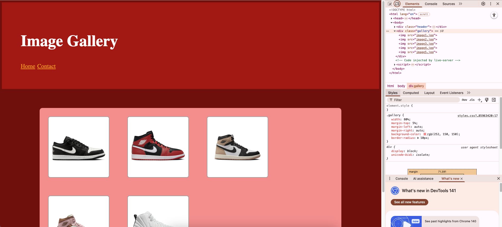
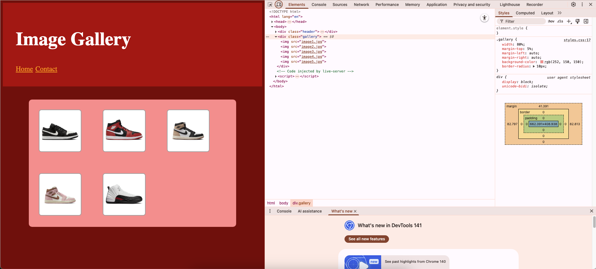

# css-units

## Learning Target
- I am learning how to use ```%``` and ```em``` to make the size of things automatically adjust with the size of the screen

## Success Criteria
- I can use ```%``` to set a property size relative to the container element
- I can use ```em``` to set a property size relative to the container’s font-size
- I can use relative units with box model properties to create designs the adapt to different screen sizes

## Directions
1. Install Live Server and Go Live to view how the webpage looks with no styling
2. Create ```style.css``` and link it to ```index.html``` 
3. Follow along with my demonstration to review using CSS box-model properties to style the header

## Example
Follow along with my demonstration to use em and % to style the header

## Exercise
Using box-model properties, style the gallery to look like the image below.  
**You should use % or em for width, margin, and padding**  
  

